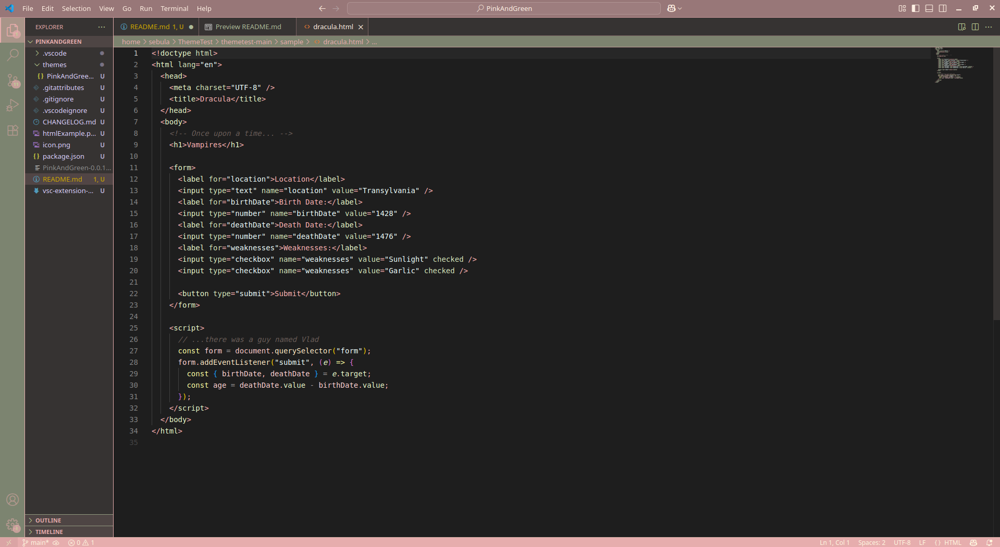

# Pink And Green Pastels README

## Images

* [Icon](https://iconduck.com/emojis/44399/peach)

Just a simple theme with a focus on pinks and greens in a dark setting for ease on the eyes. 
Blue and beige/yellow tones to fill in the gaps. 
Thank you! I hope you enjoy!!

## Thanks

* [Building your own VS Code Theme](https://www.youtube.com/watch?v=FeApSxfazVg&t=1777s)
* [Theme Studio for VS Code](https://themes.vscode.one/faq)
* [Bug Fix](https://github.com/microsoft/vscode-vsce/issues/835)

**Enjoy!**

* [My GitHub](https://github.com/SebulaET)